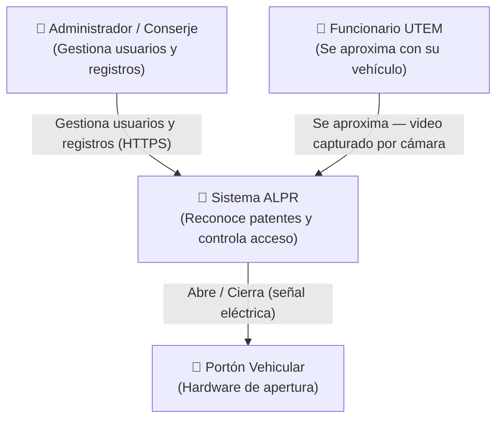
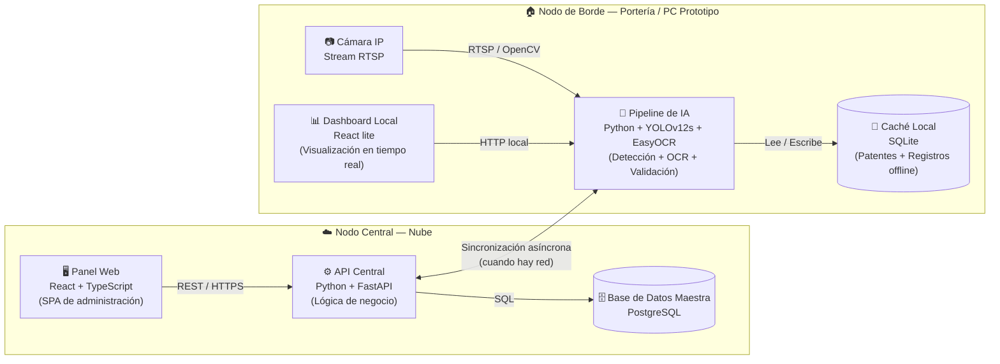
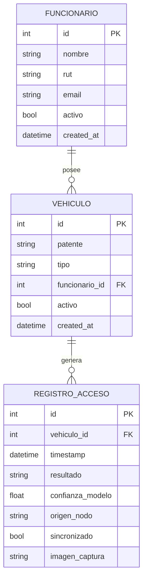
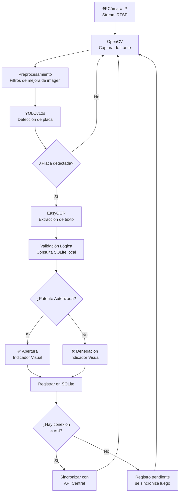
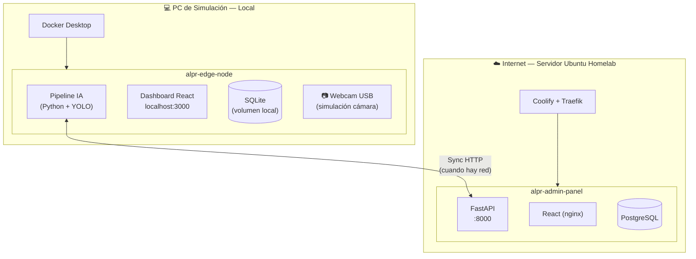

# Arquitectura del Sistema ALPR — UTEM Campus Ñuñoa

> **Estado:** Diseño finalizado (Fase 1). Base para la implementación (Fase 2).  
> **Fuente:** `main.pdf` — Capítulo 3: Desarrollo de la Solución

---

## Visión General

El sistema implementa una **Topología Distribuida** con dos nodos físicamente separados
que se comunican de forma asíncrona. Esta separación es estratégica: aísla la carga
de procesamiento de IA (continua e intensiva) de las tareas administrativas cotidianas.

---

## Diagrama de Contexto (Nivel 1)

> ¿Quién usa el sistema y cómo interactúa con él?



---

## Diagrama de Contenedores (Nivel 2)

> ¿Qué componentes de software componen el sistema?



---

## Modelo de Datos (Entidad-Relación)



---

## Flujo del Pipeline de IA (Nodo Edge)



---

## Restricciones de Latencia

| Etapa | Tiempo objetivo |
|---|---|
| Captura + Preprocesamiento | < 10 ms |
| Inferencia YOLOv12s | < 30 ms |
| OCR EasyOCR | < 40 ms |
| Validación en SQLite | < 5 ms |
| **Total pipeline (end-to-end)** | **< 100 ms** |

---

## Estructura Interna del Nodo de Borde

El Nodo de Borde vive en **un solo repositorio** (`alpr-edge-node`) con dos módulos bien separados:

```
alpr-edge-node/
├── pipeline/          # 🤖 Backend IA (Python)
│   ├── detector.py    # YOLOv12s — detección de placa
│   ├── ocr.py         # EasyOCR — extracción de texto
│   ├── validator.py   # Validación contra SQLite
│   ├── sync.py        # Sincronización con API Central
│   └── main.py        # Loop principal
│
├── dashboard/         # 📊 Frontend local (React)
│   └── src/           # Visualización en tiempo real (bounding boxes, estado)
│
├── data/
│   └── local.db       # SQLite (volumen Docker persistente)
│
└── docker-compose.yml # Levanta pipeline + dashboard juntos
```

**Razón:** Son dos procesos del mismo nodo físico (la portería), comparten recursos de red local y se despliegan juntos con `docker-compose`. Un repositorio separado agregaría complejidad de sincronización innecesaria.

---

## Infraestructura de Deploy (Prototipo)



---

## Decisiones de Arquitectura (ADRs)

| ADR | Título | Estado |
|---|---|---|
| [ADR-001](./_ADR-001-stack-central.md) | Stack tecnológico del Nodo Central | ⏳ Por documentar |
| [ADR-002](./_ADR-002-stack-edge.md) | Stack tecnológico del Nodo de Borde | ⏳ Por documentar |
| [ADR-003](./_ADR-003-docker-infra.md) | Uso de Docker como infraestructura base | ✅ Documentado |
