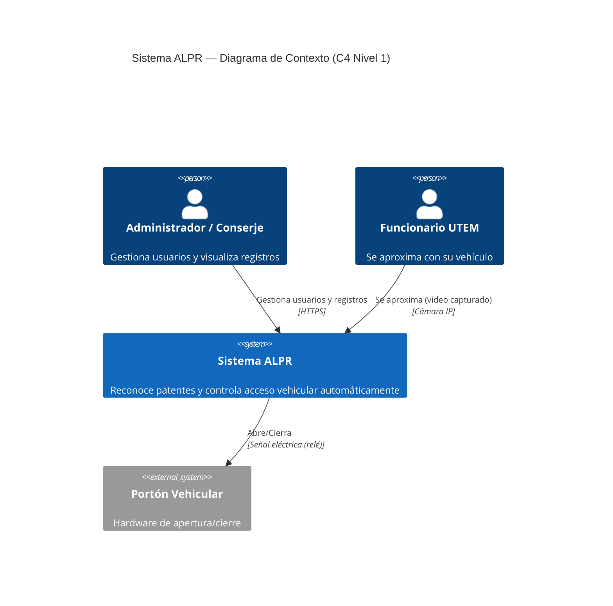
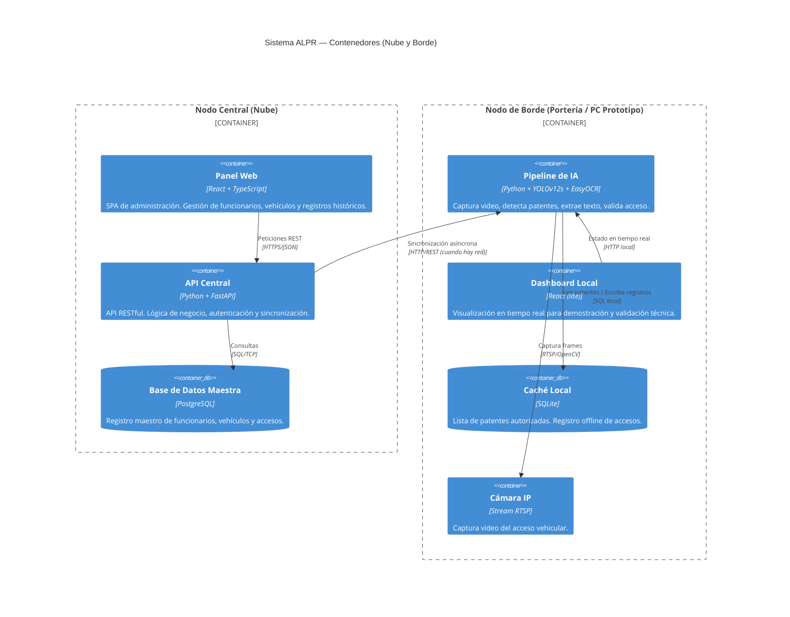
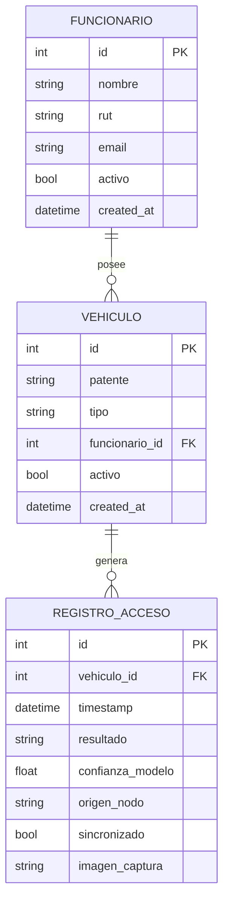
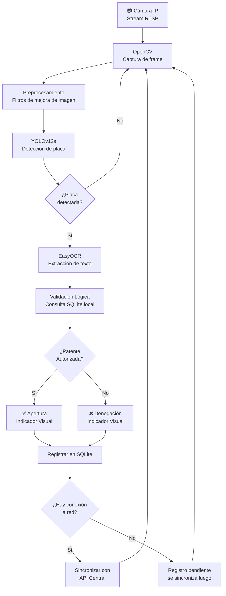

# Arquitectura del Sistema ALPR — UTEM Campus Ñuñoa

> **Estado:** Diseño finalizado (Fase 1). Base para la implementación (Fase 2).  
> **Fuente:** `main.pdf` — Capítulo 3: Desarrollo de la Solución

---

## Visión General

El sistema implementa una **Topología Distribuida** con dos nodos físicamente separados
que se comunican de forma asíncrona. Esta separación es estratégica: aísla la carga
de procesamiento de IA (continua e intensiva) de las tareas administrativas cotidianas.



---

## Diagrama de Contenedores (C4 Nivel 2)



---

## Modelo de Datos (Entidad-Relación)



---

## Flujo de Procesamiento del Pipeline (Nodo Edge)



---

## Restricciones de Latencia

| Etapa | Tiempo objetivo |
|---|---|
| Captura + Preprocesamiento | < 10 ms |
| Inferencia YOLOv12s | < 30 ms |
| OCR EasyOCR | < 40 ms |
| Validación en SQLite | < 5 ms |
| **Total pipeline (end-to-end)** | **< 100 ms** |

---

## Componentes por Repositorio

### [`alpr-admin-panel`](https://github.com/alpr-access-system/alpr-admin-panel)
- Frontend React SPA
- Backend FastAPI
- Base de datos PostgreSQL
- Docker Compose para desarrollo y producción
- Deploy en Coolify (homelab Ubuntu)

### [`alpr-edge-node`](https://github.com/alpr-access-system/alpr-edge-node)
- Pipeline Python (YOLO + EasyOCR + OpenCV)
- Dashboard React local (visualización en tiempo real)
- SQLite para caché local
- Docker Compose para ejecutar en PC/Jetson

---

## Infraestructura de Deploy (Prototipo)

```
┌─────────────────────────────────────────────────────┐
│                   Internet / Nube                   │
│                                                     │
│  ┌─────────────────────────────────────────────┐   │
│  │         Servidor Ubuntu (Homelab)            │   │
│  │   Coolify + Traefik + Docker                 │   │
│  │                                             │   │
│  │  [alpr-admin-panel]                         │   │
│  │   └── FastAPI container (puerto 8000)       │   │
│  │   └── React build (servido por nginx)       │   │
│  │   └── PostgreSQL container                  │   │
│  └─────────────────────────────────────────────┘   │
│                      ▲                              │
│                      │ Sync HTTP                    │
└──────────────────────┼──────────────────────────────┘
                       │
┌──────────────────────▼──────────────────────────────┐
│              PC de Simulación (Local)               │
│         Docker Desktop + docker-compose             │
│                                                     │
│  [alpr-edge-node]                                   │
│   └── Pipeline IA container (Python)                │
│   └── Dashboard React (localhost:3000)              │
│   └── SQLite (volumen local)                        │
│   └── Cámara: webcam USB (simulación)               │
└─────────────────────────────────────────────────────┘
```

---

## Decisiones de Arquitectura (ADRs)

| ADR | Título | Estado |
|---|---|---|
| [ADR-001](./ADR-001-stack-central.md) | Stack tecnológico del Nodo Central | ⏳ Por documentar |
| [ADR-002](./ADR-002-stack-edge.md) | Stack tecnológico del Nodo de Borde | ⏳ Por documentar |
| [ADR-003](./ADR-003-docker-infra.md) | Uso de Docker como infraestructura base | ⏳ Por documentar |
